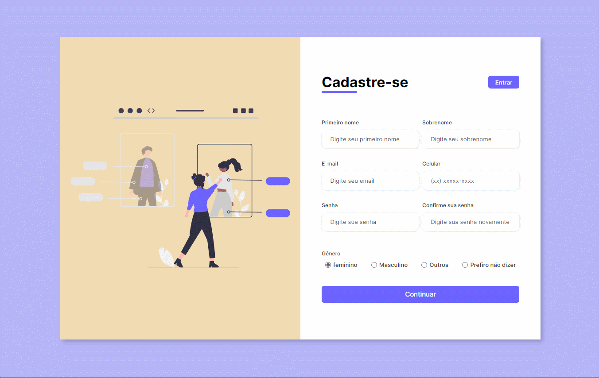

<h1 align="center">
  
Registration Form

</h1>

## ✨ Final Project

<h1 align="center">
  
  <a href="https://cutekitten001.github.io/formulario_cadastro/" target="_blank">Demo</a>
</h1>

 

## 📋 About

This is a very simple and **responsive registration form** website

 

---

## 🚀 Technologies and Tools

 

---

## 🌱 Contributing

> <strong>Step 1:</strong> `fork` this repository

> <strong>Step 2:</strong> Add a new branch with your new feature: `git checkout -b my-feature`

> <strong>Step 3:</strong> Commit your new features: `git commit -m "feat: my new feature"`

> <strong>Step 4:</strong> Push to your branch: `git push origin your-branch`

> <strong>Final:</strong> After merge your pull request, you can delete your branch

 

---

## 📑 License

This project is under the MIT license. See the file [LICENSE](url) for more details.

 

---

## 🟣 Credits

Made with ❤ by me
